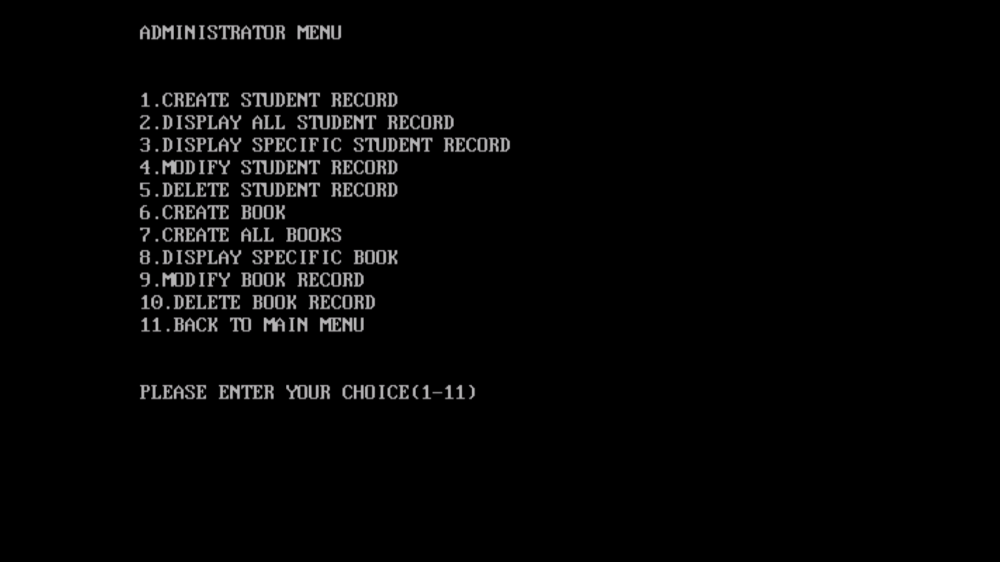
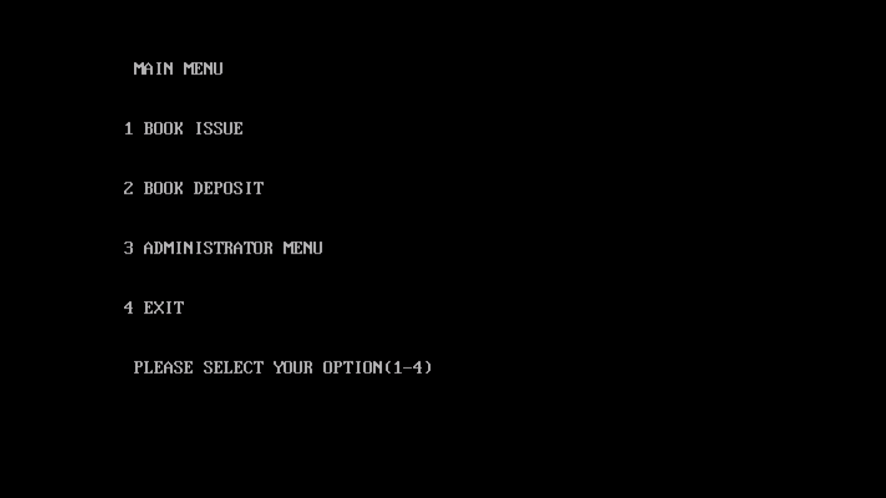

# Library Management System

# Library Management System

This Library Management System allows efficient management of library operations, including book records, issuing books, and tracking returns.

## 📸 Screenshots

## Administrator menu

## Rules

- Each student can hold only one issued book at a time
- A new book cannot be issued until the previously issued book is returned
- Late returns are subject to a fine based on the due date policy

## mein menu

## Features

- Add new books to the library inventory
- View and retrieve details of available books
- Issue books to students
- Maintain student issue records
- Prevent issuing a new book if the previous one has not been returned
- Apply late fines for books returned after the due date

## Purpose

The system is designed to simplify library operations, reduce manual tracking errors, and ensure proper management of book circulation among students.

